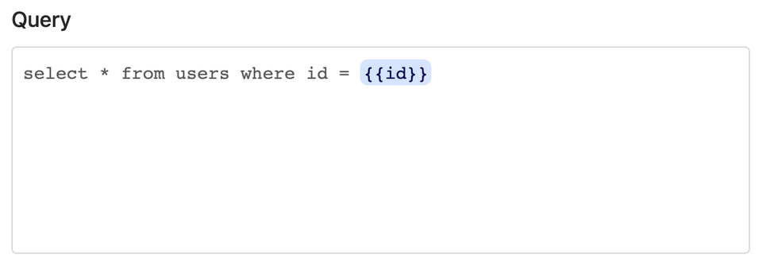
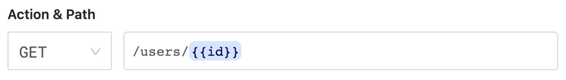
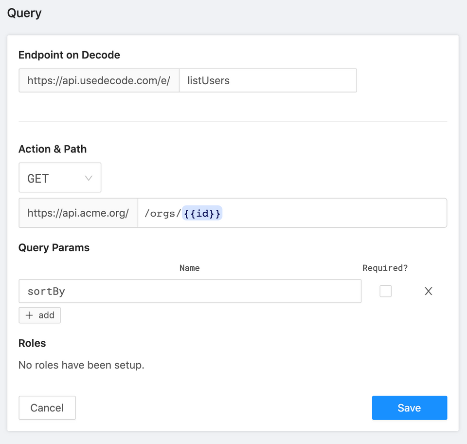

# Reference

## Variables

You can use variables in both database and HTTP queries.

For example, here's a database query that contains an `id` variable in its statement:


<!--  -->

And here's an HTTP query that contains an `id` variable in its path:



<!--  -->

You specify variables by wrapping the variable in `{{}}`.

**Using variables in `useDecode`**

To call this endpoint from the front-end:

```jsx
function ShowUser({ id }) {
  let { data: user } = useDecode(["getUser", { id }]);

  // ...
}
```

You pass in an _array_ as the first argument. The first element is the slug, the second element is params for the request.

If you've used useSWR in the past, you might think you need to memoize `{ id }` . Not with `useDecode` - the library memoizes for you under the hood.

**Dependent variables**

Sometimes, one request might depend on the results of another, like this:

```jsx
function ShowUser({ id }) {
  let { data: user } = useDecode(["getUser", { id }]);
  // Error: will fail initially as `user` is not available
  let { data: companyOrders } = useDecode([
    "getCompanyOrders",
    { id: user.companyId },
  ]);

  // ...
}
```

Just pass a function to `useDecode` that returns the array instead. `useDecode` will invoke the function to derive the query parameters. If the function throws an error or returns `null`, Decode will assume it's because the query depends on another fetch. It will try again after "getUser" succeeds:

```jsx
function ShowUser({ id }) {
  let { data: user } = useDecode(["getUser", { id }]);
  let { data: companyOrders } = useDecode(() => [
    "getCompanyOrders",
    { id: user.companyId },
  ]);

  // ...
}
```

### HTTP requests

Let's say you have an HTTP request that looks like this:


<!--  -->

Path and query param variables are passed in to `useDecode` as top-level properties in the params object, like this:

```jsx
function ShowOrgUsers({ orgId }) {
  let { data: users } = useDecode(["listUsers", { id: orgId, sortBy: "asc" }]);

  // ...
}
```

Often for write requests (i.e. POST/PUT/PATCH), you want to send along a body. Say you have an HTTP request that look like this:


<!--  -->

Here's how you'd invoke the request:

```jsx
function EditUser({ id }) {
  let fetcher = useFetcher();

  let handleSubmit = ({ name, email }) => {
    fetcher("patchUser", { id, body: { name, email } });
  };
}
```

Decode will match `id` up with the required variable in the path. Everything under `body` will be forwarded along to the upstream API, like this:

```jsx
PATCH https://api.acme.org/1234
{
  name: "Gabe Goldman",
  email: "gabe@example.com"
}
```

## `useDecode`

Underneath the hood, `useDecode` wraps the SWR library. You can find the docs for SWR here:

📔[https://github.com/vercel/swr](https://github.com/vercel/swr)

So, if you know how to do something with SWR, you can probably do it with `useDecode`!

The key difference: You pass in an endpoint and a `fetcher` function to SWR, like so:

```jsx
let { data, error } = useSWR("/api/users", fetcher);
```

Whereas all you need to pass to `useDecode` is a slug, like so:

```jsx
let { data, error } = useDecode("getUser");
```

In addition, you can _optionally_ pass in a "transform" function, like this:

```jsx
import camelcaseKeys from "camelcase-keys";

// ...

let { data, error } = useDecode("getUser", camelcaseKeys);
```

The transform function runs after the results are received from Decode but before they are cached by SWR. So, the data is in its "post transformation" state throughout your React app.

Put another way, this is the pipeline:

```bash
fetched from decode
|> transformed by transform function
|> cached and returned
```

## Using Decode without `useDecode`

If you do use any of the strategies below, [we'd definitely love to hear why](../contact).

If you'd prefer to make requests without using `useDecode`, you have a few options:

1. `useFetcher` + SWR

This can be helpful if for whatever reason you want to use SWR more directly:

```jsx
import { useFetcher } from "@decode/client";
import useSWR from "swr";

// ...

let fetcher = useFetcher();
let { data } = useSWR("listUsers", fetcher);
```

2. `useFetcher` on its own

Remember, you can use the fetcher to just make requests at any time:

```jsx
import { useFetcher } from "@decode/client";

// ...

let fetcher = useFetcher();

useEffect(() => {
  let doEffect = async () => {
    let data = await fetcher("listUsers");
  };
  doEffect();
});
```

3. `useToken` to use plain old fetch

Last, you can use `useToken` to grab an API token you can use to make a plain old fetch request:

```jsx
import { useToken } from "@decode/client";

// ...

let token = useToken();

useEffect(() => {
  let doEffect = async () => {
    let res = await fetch("https://api.usedecode.com/e/listJobs", {
      method: "POST",
      headers: {
        Authorization: `Bearer ${token}`,
      },
    });
    if (!res.ok) {
      setError("Uh oh, something went wrong when fetching that request.");
    }
    let json = await res.json();
    let data = res.result;
  };
  doEffect();
});
```

## Errors & Debugging

A Decode error response looks like this:

```jsx
{
  "ok": false,
  "who": "upstream",
  "error": {
    "summary": "Query to database hit timeout limit (10s)"
  }
}
```

- `ok` - whether or not the request succeeded
- `who` - who is "responsible" for the error. Possible values are `you`, `decode`, and `upstream` (the API or database you are calling).
- `error.summary` - Decode tries its best to unpack and describe the error

Here are some of the error status codes you might receive:

`**422**`

This means the gateway was "unreachable." This is most commonly experienced when Decode can't connect to a database.

**`502`**

This means the _upstream_ resource returned an error.

If you're calling an API:

- the `summary` will include the HTTP status code returned by the API
- the object may include `error.upstream_error_body`, which contains the contents of the error body received from the API

**`400`**

You made a bad request. Most commonly, you are not including required variables in your request.

**`404`**

The slug you are attempting to invoke is not registered on Decode.
