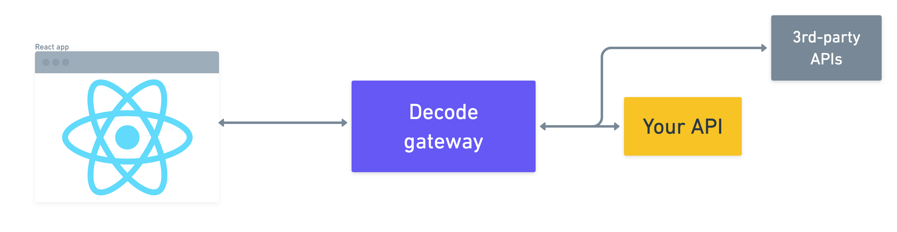
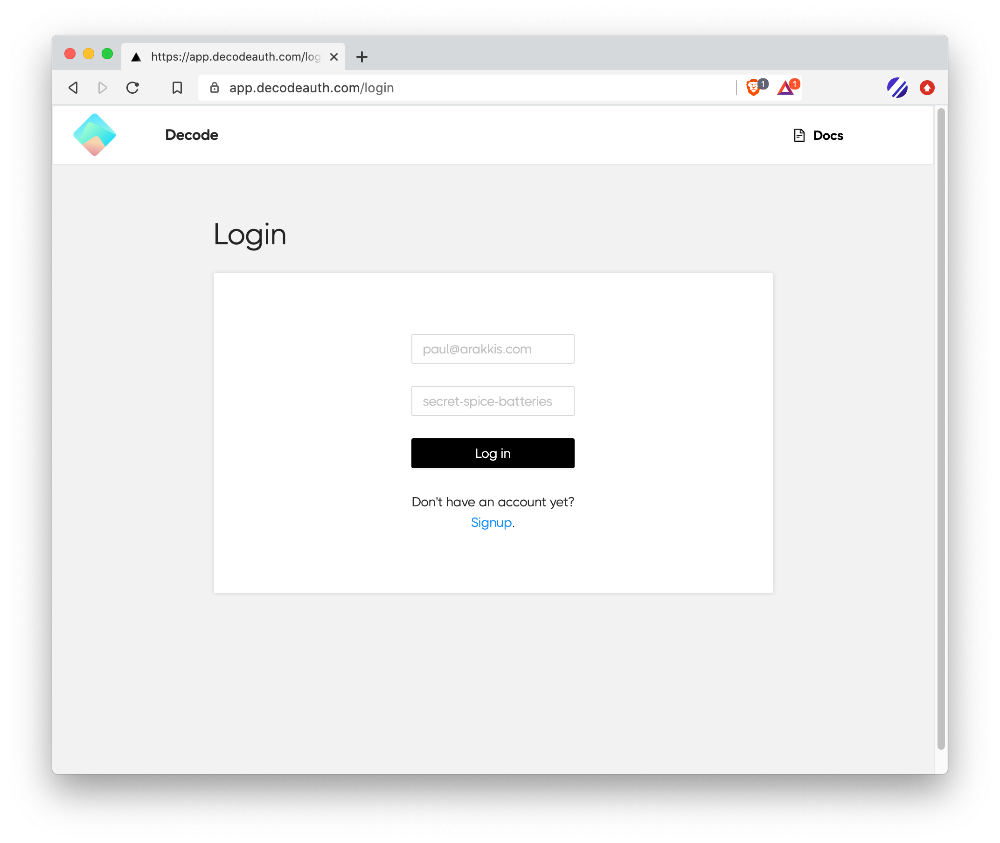
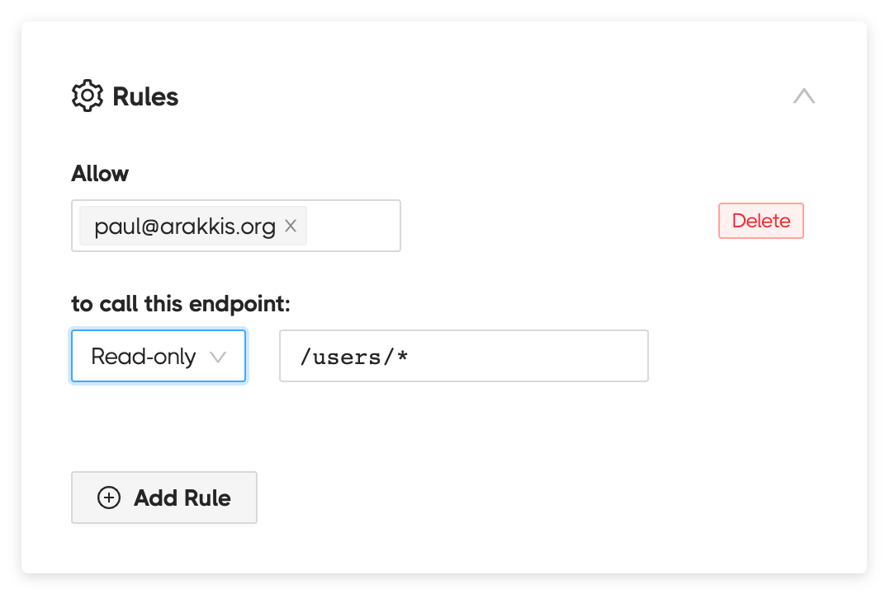

# Reference

## Overview

Decode makes it easy to add team logins to your React apps. You use Decode's _gateway_ to setup access controls, specifying who on your team can call which endpoints.

The Decode gateway sits between your React app and back-end APIs, like this:



We have client-side and server-side libraries that make this request flow easy to setup and maintain.

For the client, we have a React SDK that lets you setup logins in your app in just a minute.

For back-end APIs, you have two options:

1. Wrap an API in Decode's server-side library to add authentication to it
2. Connect to an API with existing authentication

If you're building an internal admin API, #1 is a great, easy option. If you already have an API that's hard to change or you're connecting to a third-party API (like Airtable or Stripe), then #2 is your best bet.

Below, we'll cover the three primary areas of each request:

1. The Decode React library, where requests originate
2. The Decode API gateway, where authorization is specified
3. The server, which can use Decode's middleware to authenticate requests

## The Decode React library

Decode's React library is a lightweight package that adds login and token management to your app.

The library includes TypeScript definitions.

The library exports one component and one function:

### `<AuthProvider />`

Import this component near the top of your component tree and wrap your app in it:

```js
// inside index.js in a Create React App app
import { AuthProvider } from "@decode/client";

return (
  <AuthProvider>
    <App />
  </AuthProvider>
);
```

When `<AuthProvider />` is mounted, it will check if the user is logged in. If not, it will automatically redirect to the Decode login page:



> Customizable, branded login pages coming soon!

If you want only a section of your app to be wrapped in log-in, then just wrap that portion.

This component doesn't require any configuration.

### `wrapFetch(fetch, opts)`

`wrapFetch()` takes `fetch` (i.e. `window.fetch`) as its first argument. It returns a fetch function that has a few special features. In particular, access token management is taken care of for you. And all requests are routed through the Decode gateway:

```js
const fetch = wrapFetch(window.fetch);

export const listUsers = async () => {
  // this request resolves to
  // https://api.decodeauth.com/p/example.com/api/admin/users
  fetch("https://example.com/api/admin/users"); // token will be added right before request
};
```

Again, you don't need to configure `wrapFetch()` at all.

Referring to `window` like this in the top-level scope can cause an issue in some environments with server-side rendering (SSR), like Next. So alternatively you can just declare a function like this:

```js
function fetch(input, init) {
  return wrapFetch(window.fetch)(input, init);
}

export const createUser = async (user) => {
  // use `fetch()` just like you always do
  fetch("https://example.com/api/admin/users", {
    body: JSON.stringify({ user }),
    headers: {
      "content-type": "application/json",
    },
  });
};
```

Or, with Typescript definitions:

```js
function fetch(input: RequestInfo, init?: RequestInit) {
  return wrapFetch(window.fetch)(input, init);
}
```

`wrapFetch()` accepts a second optional object for config. At the moment, there is just one option:

- `notifications` (default: `false`)

When `notifications` is `true`, as in below:

```js
const fetch = wrapFetch(window.fetch, { notifications: true });
```

Then a notification is shown whenever:

- A write request (POST/PUT/PATCH/DELETE) succeeds or fails
- A read request (GET) fails

This can be handy for internal tools where you want to make it clear to the user that an action worked, but don't want to fuss with coding up the UI logic every time.

> Do you want to see wrappers for other fetching libraries, like Axios? Do us a favor and <a class="docs-help" href="mailto:founders@decodeauth.com">click here</a> to let us know.

## The Decode console

The Decode console is where you create and manage users and APIs. Specifically, you control authorization through _Rules_ - dictating who can do what.

Here's an example of an API with a single rule - one that grants Paul read-only access to `/users/*`:



Here's a quick 3 minute demonstration of the console and configuring Rules:

<div style="position: relative; padding-bottom: 50.373134328358205%; height: 0;"><iframe src="https://www.loom.com/embed/a6029546beff432ca776e148902d4ab7" frameborder="0" webkitallowfullscreen mozallowfullscreen allowfullscreen style="position: absolute; top: 0; left: 0; width: 100%; height: 100%;"></iframe></div>

You can add users to your Decode org, create groups of users, and then control how both groups and users can interact with your api.

## Server-side middleware

If you're building a new API or want to make maintenance of your current API easier, we recommend you use our server-side middleware to wrap your API in authentication.

Because you take care of authorization rules on Decode, you don't need to write any such business logic on your server. Our middleware can safely assume that if a request is coming from Decode, that user has been granted permission to make that request.

The installation process for server-side middleware takes under 5 minutes:

1. Install the package
2. Insert the middleware before your admin API endpoints
3. Save your Decode public key to your repository
4. Deploy!

We currently have middleware for Node.js and Elixir. We'll refer you to the READMEs of each for installation instructions (in all cases, it's a piece of cake):

- [Node/Express](https://github.com/usedecode/decode_server/tree/master/decode_server_js)
- [Elixir/Phoenix](https://github.com/usedecode/decode_server/tree/master/decode_server_ex)

> We're releasing libraries for Python/Django, Ruby/Rails, and Go throughout November 2020, with more coming in December. <a class="docs-help" href="mailto:founders@decodeauth.com">Let us know</a> which library you want to see support for and we'll prioritize it!

## Developing locally

We're still working on tools to make local development as simple as possible.

For now, your best bet is to use one of the following tools to make your local server accessible to Decode's gateway server:

- [Localtunnel](https://localtunnel.github.io/www/)
- [Ngrok](https://ngrok.com/download)

Localtunnel is free and easy to get started with if you have NodeJS already installed on your computer. So we'll demonstrate using Localtunnel here.

**Serve**

Use `npx` to download and execute Localtunnel in one command:

```
$ npx localtunnel --port 3000 --subdomain decode-acme-corp
your url is: https://decode-acme-corp.loca.lt
```

The server running on port `3000` is now accessible at `https://decode-acme-corp.loca.lt`.

You want to choose a subdomain that is likely to always be available so you can use the same one every time. We recommend using the format `decode-[your_org_name]`.

**Direct traffic from Decode**

Now that your tunnel is serving traffic to your local server, you just need to tell Decode how to reach it.

We recommend setting up a new API in the Decode console that you'll use just for local development:

<div style="box-shadow: rgba(0, 0, 0, 0.12) 0px 5px 10px 0px; margin: 0px 25px;">
  
</div>

After saving, traffic can now flow from your React app, through the Decode gateway, and to your local API server.

**Optional: Installing Localtunnel**

If you'd prefer to install Localtunnel globally, you can do so like this:

```
$ npm install -g localtunnel
$ lt --port 3000 --subdomain decode-acme-corp
your url is: https://decode-acme-corp.loca.lt
```

> We're going to roll out a native tunneling tool soon to make this whole process even smoother. We're prioritizing based on demand, so <a class="docs-help" href="mailto:founders@decodeauth.com">let us know</a> if this is something you'd like to see!
