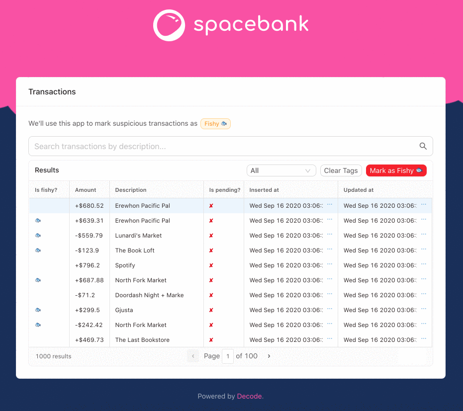
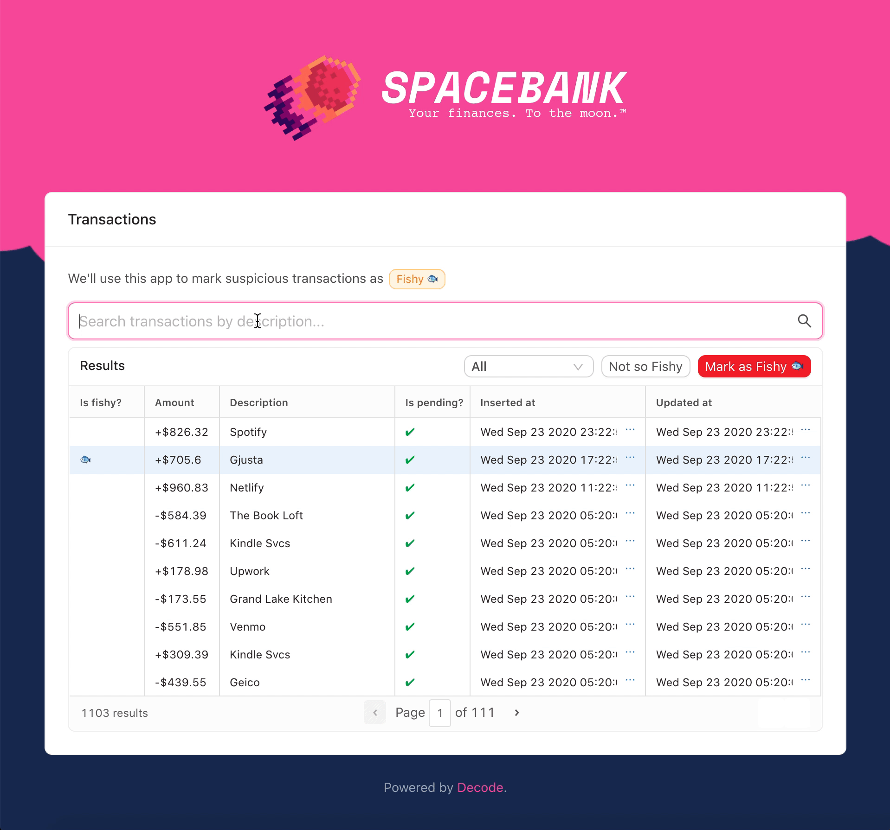

# Walkthrough

## What is Decode?

Decode is a full-stack toolkit for developing internal tools in React. Internal tools are the stuff that employees at companies use, like customer support dashboards or ops tools.

You can logon to Decode and connect your HTTP APIs and databases. Then, you can write queries against those resources. For each query, Decode will provision a special secure endpoint. You can read/write from that endpoint with Decode's client-side React SDK.

## Overview - Let's build an app

In this tutorial, we're going to build a tool for a bank, Spacebank. This tool is used by the bank's risk team to mark transactions as _fishy_ 🐟. Admins work through a table of transactions that they can sort and filter. They can mark a transaction as fishy/not fishy:



We'll make use of the following Decode features to bring this app to life:

- Zero-config authentication
- Direct database queries
- Decode hooks
- Decode components with built-in data fetching

⏱️This tutorial will take about 10 minutes to complete.

### The React app

You'll find a fresh, incomplete version of Spacebank over on this Codesandbox:

[https://codesandbox.io/s/github/usedecode/spacebank-client?file=/pages/index.tsx](https://codesandbox.io/s/github/usedecode/spacebank-client?file=/pages/index.tsx)

The basic styles are in place, and some components are laid out. But this app isn't connected to any back-end data sources. Let's change that.

### Resources

When you first sign-up for Decode, we pre-populate your account with two _resources_.

A resource can be either an HTTP API or a database (Postgres, MySQL, or MSSQL).

If you head over to the [Resources](https://dashboard.usedecode.com/resources) view, you'll see the two resources listed:

1. Spacebank API
2. Spacebank db

For this app, you'll use direct database queries for most of your reads. And you'll use the API for your writes (eg, marking a transaction as "Fishy").

This is common practice for internal tools. Composing database queries with Decode is fast and easy, and we can avoid needing to write bespoke endpoints to power this tool. For writes, often teams prefer using their API so they can run queries through application-level validation and ensure data integrity.

You don't need to make any changes to the resources. But let's see how they're each setup.

**API resources**

Click on the "Spacebank API" resource and you'll see how APIs are specified in Decode:


The Spacebank API resource.

For APIs, you specify:

- The base URL of the API
- The security scheme Decode can use to connect to the API

Decode supports a variety of authentication schemes, but if you don't see your desired scheme listed just [let us know.](https://www.notion.so/usedecode/Spacebank-ef1ce8d5b80847c8827554a4b7dd8061#656dfbb11f2d44fc958fc90edeec413d)

Decode will use the same security scheme to call the API resource for every user. If you want to have user-dependent authentication, [we'd love to hear your use case](https://www.notion.so/usedecode/Spacebank-ef1ce8d5b80847c8827554a4b7dd8061#656dfbb11f2d44fc958fc90edeec413d).

**Database resources**

Next, click on the "Spacebank db" resource. For databases, note you just specify the connection details:


The Spacebank database resource.

In just a moment, we'll see how we use the Decode client library to securely route requests through Decode and to our two resources:


But first, you need to define your first query.

### Your first query

Your first task is to add a table to Spacebank that displays the transactions from the `transactions` table in the Spacebank database.

In order to do that, you need to compose a _query_. A query is how we fetch data from a resource. For HTTP APIs, a query is a request description, eg `GET /transactions`. For databases, a query is a SQL statement.

Head over to [Queries](https://dashboard.usedecode.com/queries) and select "+ Add your first query." Select the Spacebank database. You'll be prompted with the query editor for SQL:


The query editor, where we'll add our first query.

Under **Endpoint**, fill in `listTransactions`. This will be the _slug_ of the query. You'll see how this slug comes into play in just a moment.

Under **Query**, write your SQL query. The Spacebank database has a table called `transactions`. To start, you can just grab all the transactions like this:

```jsx
SELECT * FROM transactions order by inserted_at desc limit 10000;
```

Now, click the **Test** button. You'll see a panel with the label "✅ Result" appear:


After clicking test, the Result panel will appear.

Click on the panel to slide it open. You'll see a formatted JSON response. This is a preview of the JSON that this query will return to our React front-end:


The JSON returned by this query. Note that we store tags - like whether or not the transaction is fishy - in another table.

This looks good. Go ahead and click "Save."

And just like that, you've turned a SQL query into an API endpoint. It's protected by a layer of authentication. If you tried to just `curl` this endpoint, you'd get an error:

```bash
$ curl -X POST https://api.usedecode.com/e/listTransactions
{
  "error": {
    "summary": "Authorization failed. Did you include a token in your headers like: `Authorization: Bearer {{token}}`?"
  },
  "ok": false
}
```

Adding authentication to an app and fussing with API tokens is always a pain. Luckily, Decode makes this as simple as possible.

### Easy authentication with `<DecodeProvider />`

It's time to start editing the Spacebank React app. Again, the Codesandbox for that is here:

[https://codesandbox.io/s/github/usedecode/spacebank-client?file=/pages/\_app.tsx](https://codesandbox.io/s/github/usedecode/spacebank-client?file=/pages/_app.tsx)

You'll only be editing two files in this tutorial:

- `pages/_app.tsx`
- `pages/index.tsx`

The rest of the project provides style and helper components.

To add authentication to the app, all you have to do is wrap the top-level component inside `pages/_app.tsx` with `<DecodeProvider />` , like this:

```jsx
function MyApp({ Component, pageProps }) {
  return (
    <DecodeProvider>
      <Component {...pageProps} />
    </DecodeProvider>
  );
}
```

This app uses Next. The component here will always be the top-level component in the tree.

For projects using Create React App, you do the same thing - but wrap your components at the top-level inside `index.js`.

When you save, it will look like nothing has happened. But that's because _you're already logged into Decode in this browser_, so `<DecodeProvider />` validated you were logged . This all happened so fast, you probably didn't even notice!

To prove it, copy the Codesandbox URL, which you can find here:


Then, open an "incognito" or "private" browser window (`CMD + SHIFT + N` on the Mac in most browsers). Paste in the URL - and now you're redirected to the Decode login page:


If you login, you'll be seamlessly redirected back to the Spacebank app.

But `<DecodeProvider />` doesn't just enforce login. The provider is also the powerhouse behind data fetching with Decode.

Now that the provider is in place, you can seamlessly fetch data from back-end resources. Let's start with having you pull `listTransactions` into a table.

### `<ConnectedTable />`

Decode provides both _hooks_ and _components_ that are pre-integrated with the Decode back-end. The first one we're going to look at is `<ConnectedTable />`. You're going to love it.

In the Spacebank React app's Codesandbox, open up the file `pages/index.tsx`. This file has some scaffold in it already, which we'll touch on in a bit.

Scroll down and replace this placeholder:

```jsx
<div className="table-placeholder">
  <span>Table will go here</span>
</div>
```

With this:

```jsx
<ConnectedTable fetchKey="listTransactions" />
```

Save, and your table - complete with data from your database - will greet you:


`<ConnectedTable />`, which automagically pulls data from Decode.

Just a few lines of code, and we have a React app protected by authentication that's pulling in data to a table via a SQL statement!

`<ConnectedTable />` dynamically generated default columns. They don't look bad, but eg `amount_in_cents` could use some formatting.

You can pass in a `columns` prop to `<ConnectedTable />` to configure the columns. We already set up some good defaults for you - just go ahead and add this line:

```jsx
<ConnectedTable fetchKey="listTransactions" columns={memoizedColumns} />
```

If you look higher up in the file, you'll see where `memoizedColumns` is defined. We want to memoize the columns, because if we don't, `<ConnectedTable />` will recompute the table on every render.

Last, while you're here, set the `onSelectRow` property of the `<ConnectedTable />` . You want it to set the `selectedTransactionId` state variable (defined at the top of the component) whenever the user selects a row:

```jsx
<ConnectedTable
  fetchKey="listTransactions"
  columns={memoizedColumns}
  onSelectRow={(row: any) => setSelectedTransactionId(row.id)}
/>
```

With `memoizedColumns` in place, your table should be looking great!


`<ConnectedTable />`, with prettier, formatted columns.

And if you select a row, you'll see the action buttons "Not so Fishy" and "Mark as Fishy" light up, as a row is selected. (But, they don't do anything just yet.)

As a next step, let's add some interactivity to your app. We'll start with the transaction filtering. A user can filter transaction by:

- entering a search query (which searches the `description` column)
- selecting a time filter from the drop-down

Underneath the hood, `<ConnectedTable />` wraps the most popular React table library, [React Table](https://react-table.tanstack.com/). The component configures React Table with styles, sane defaults, and, of course, data fetching from Decode.

We're still building out the docs for `<ConnectedTable />`. But the docs for React Table largely apply.

### Adding variables to queries

Right now, your `listTransactions` query grabs all the transactions from the database. You can make it more powerful by weaving in _variables_.

Hop back over to your query in the [Decode dashboard](https://dashboard.usedecode.com/queries). Go ahead and modify the query accordingly:

```sql
SELECT * FROM transactions
WHERE LOWER(description) LIKE LOWER({{description}})
and inserted_at > {{after}}
ORDER BY inserted_at DESC LIMIT 10000;
```

When it's typed out, you'll notice that Decode highlights the variables in the query:


This query now accepts two variables which act like filters on the data:

- `description` , which we wrap in SQL's `LOWER()` , just to make the comparison case insensitive
- `after`, which is your date filter

You _could_ write a separate query, `searchTransactions`, which uses these two variables. Then, `listTransactions` is used whenever there are no filters and `searchTransactions` is used when there are filters. But we'll see in a moment that it's not much hassle to just reuse the same query in all situations.

Click "Test." You'll be prompted to enter values for each variable that Decode can use to test your query. Use the variables below:

- `%erewhon%`
- `1970-01-01T00:00:00.001Z`


Variable values that will be used to test the query.

We know. You're like - "You're going to make me type in a timestamp whenever I want to test this query??" We are going to make this part _way easier_ very soon. Stick with us.

Hit "Save & Test." If you look at the results returned, you'll only see transactions from Erewhon in the response. (Someone has an addiction. 👀)

Click "Save" to save your query.

Until we improve defining test variables, you always have the option to skip database query tests. Just click the "..." next to the "Save" button and click "Skip Tests & Save."

Now, if you flip back over to Spacebank, you'll find that there's an error!


Behind the scenes, all Decode components and hooks poll on occasion for new data to make sure the React app has the latest stuff. Because you re-focused on the Spacebank window, `<ConnectedTable />` attempted to re-fetch the query. Except now, the query requires your two new variables.

Let's feed those variables to `<ConnectedTable />` now.

Starting with `description`, you'll note that the search input on this page is already hooked up to state:

```sql
export default function App() {
// ...
  let [search, setSearch] = useState("");
  let debouncedSearch = useDebounce(search, 500);

  // later, in render()...
  <SearchInput value={search} onChange={setSearch} />
```

If you connected `search` right to `<ConnectedTable />`, then every single keystroke would fire off a request to Decode. While our servers welcome the challenge, this is inefficient.

Instead, you want to _debounce_ the search value - wait until 500ms have passed since the user's last keystroke _and then_ fire off the search.

`useDebounce()` is a simple convenience hook we included which does just that. You'll supply the debounced value it returns to `<ConnectedTable />` as opposed to `search`.

Then, for the `after` filter, that's also controlled in state at the top:

```sql
export default function App() {
  // ...
  let [dateFilter, setDateFilter] = useState("all");
```

You can use the function below `App` , `dateFromFilter()`, to convert the human-friendly drop-down values of "All", "Last 7 days", and "Last two weeks" into ISO8601 timestamps that Decode and your database will be happy with.

Decode will try to securely cast variables into a format appropriate for the database column you are querying against.

Note that casting is **very limited** for MySQL and MSSQL databases. If you run into problems, [let us know](https://www.notion.so/usedecode/Spacebank-ef1ce8d5b80847c8827554a4b7dd8061#facff445d39944aa810887fa2a629466).

Ok, with that context in place, go ahead and update the `fetchKey` for `<ConnectedTable />`:

```jsx
<ConnectedTable
  fetchKey={[
    "listTransactions",
    {
      description: `%${debouncedSearch}%`,
      after: dateFromDateFilter(dateFilter),
    },
  ]}
  columns={memoizedColumns}
  onSelectRow={(row: any) => setSelectedTransactionId(row.id)}
/>
```

Your `fetchKey` is now an array, as it's a composite of the query (`listTransactions`) and your variables (`description` and `after`). When using fetch keys with Decode hooks and components, they will always be formatted like this.

Note that above, `debouncedSearch` is wrapped in `%%` - this will give you a fuzzy match on description, which is preferable here.

Go ahead and save and try it out! Typing in `gjusta` filters the results:


Someone has a serious Postmates problem.

This app is getting pretty powerful. It's wrapped in authentication. You can now filter transactions by their description or their recency. And you can sort and page through the results.

But it's missing the core functionality: marking suspicious transactions as fishy.

For the home stretch, you'll quickly set up three HTTP queries on Decode:

- `listTaggedTransactionIds` - grabs the ids of transactions marked "fishy"
- `tagTransaction` - marks the transaction as "fishy"
- `untagTransaction` - removes the "fishy" tag

Then, you'll wire up the React app to these HTTP endpoints with Decode.

Underneath the hood, Decode hooks and components use Vercel's [SWR](https://github.com/vercel/swr). A lot of the documentation for that project applies to Decode's data-fetching paradigm. In fact, you can tweak Decode's SWR instance by passing in a config object like this: `<DecodeProvider swrConfig={{ /* your config */ }} />` .

If you're familiar with SWR, there are a couple key differences though. One that you may have noticed above: You don't have to worry about memoizing the object in the `fetchKey` array. The Decode client takes care of that for you.

### Adding HTTP queries

As you saw earlier, your account comes pre-populated with one HTTP resource, the Spacebank API. This API is protected by an auth token, which we kindly supplied for you.

To read and write tags, you'll use this HTTP resource as opposed to the database.

Head back over to [queries](https://dashboard.usedecode.com/queries) and click "Add query," then select "Spacebank - API."

This first request will get a GET request to grab the list of IDs for transactions marked fishy:


Like before, `listTaggedTransactionIds` is the endpoint you're creating on Decode - the _slug_ of the query.

Below that, you define the HTTP request that you want Decode to make against the Spacebank API to retrieve data. Here, you're specifying a `GET` request to the path `/tagged_transaction_ids`.

That endpoint requires one query param, `name` . This will be the name of the tag (in the case of this app, it will always be the value `"fishy"` ).

Once you've filled in the details, click "Test." This will open the HTTP testing window. Fill in the value "fishy" for the `name` param and click "Run test":


The result shows the result returned straight from `https://spacebank.onrender.com/api/tagged_transaction_ids`. As you can see, `ids` is an empty array. Because no one has tagged any transactions as "fishy" yet. (You need to get this app over to Spacebank Risk, stat!)

Click "Save." Now, add the query for creating a tag by following the same flow of "Add Query → Spacebank - API":


This time, it's a POST to `/transactions/{{transactionId}}/tag`. You're using a variable in the path, `transactionId`.

This particular request requires a _body_ in the request, like this: `{ "name": "fishy" }`. You don't define the body here though - it will be part of the fetch key. You'll see that come into play in a moment.

This one will be harder to test as you don't have an ID handy, so just click "Save."

Now for the last query. "Add Query" again, this time it's a `DELETE` to the same path as above:


Ok, these queries are ready to go - Decode is fully setup now.

Hop back over to the Spacebank code. This first thing you'll do is pull in the list of fishy transaction ids via the query `listTaggedTransactionIds`.

Un-comment this section:

```jsx
// Retrieve transactions tagged Fishy from api using Decode
// TODO: let { data, mutate } = useDecode<ListTaggedTransactionIds>([])
```

And fill it out, like this:

```jsx
let { data, mutate } =
  useDecode <
  ListTaggedTransactionIds >
  ["listTaggedTransactionIds", { name: "fishy" }];
```

Then below that, modify `fishyIds` like so:

```jsx
let fishyIds = data?.ids || [];
```

Breaking this down:

- You're now using the `useDecode()` _hook_. This hook is central to data-fetching with Decode. In fact, all Decode components just use this hook for data-fetching underneath the hood.
  - This hook returns `data`, the result from Decode, and `mutate`. You'll see `mutate` used in just a moment.
- Notice that the fetch key supplied to the `useDecode()` hook matches the format you used for `<ConnectedTable />` - it's a composite of the slug and the required variable, `name` (which in this case is assigned to a query parameter).
- `useDecode()` can accept a type argument, which will define the type of `data`. Here, the type argument is `ListTaggedTransactionIds`. (This is a TypeScript thing - if you don't know TypeScript, feel free to ignore! This type argument is completely optional.)
- Last, note that `fishyIds` now tries to grab the ids from the `data` object.

`fishyIds` is fed into the `memoizedColumns` below. The `fishyColumn` logic takes care of displaying a fish emoji if a given row has been marked fishy. So you're all set here!

Next, you just need to wire up the "Mark as Fishy" and "Not so Fishy" buttons.

So far, the hooks and components you've used have been performing _reads_. To create and delete tags, you'll have to do _writes._

As you may know, React hooks are not a good fit for writes. Instead, you just want a function you can call one-off whenever the user clicks one of the two buttons.

Decode provides the `useRequest()` hook for that. That hook returns a function that you can then use to make one-off requests to Decode.

Write the handler functions first, then you'll wire them up to the buttons after. You can put these right below the code you just wrote:

```jsx
// Used for one-time requests using Decode
let { request, isProcessing } = useRequest();

// Marks a transaction as fishy
let markAsFishy = async () => {
  await request([
    "tagTransaction",
    {
      transactionId: selectedTransactionId,
      body: { name: "fishy" },
    },
  ]);
  await mutate();
};

// Remove the fishy tag from a transaction
let markNotFishy = async () => {
  await request([
    "untagTransaction",
    {
      transactionId: selectedTransactionId,
      name: "fishy",
    },
  ]);
  await mutate();
};
```

Both functions make use of the `request()` function returned by `useRequest()`.

Both `request()` invocations supply the required path parameter, `transactionId`. They also both supply the tag name "fishy." Except, for tagging transactions, the Spacebank API expects the name to be sent in the _body_ of the request. So, you can see that for `tagTransaction`, you specify a `body` property. Decode will proxy whatever is in this body property up to the target API.

After you make a request to update the list of fishy transaction ids through Decode, you need to update your _local_ list of those ids: the lazy way and the eager way.

The above example demonstrates the _lazy_ way: Right below each `request()` call, `mutate()` is invoked. This was the function returned by the `useDecode()` call to grab the list of fishy transaction ids. Calling mutate _invalidates_ the local cached copy of transaction ids, forcing `useDecode()` to immediately re-fetch.

That's one way to get the updated list - just let the server supply it!

The eager way would be to pass in the new list of ids to `mutate()`, like this (for `markAsFishy`):

```jsx
await mutate({ ids: fishyIds.concat(selectedTransactionId) });
```

This is also known as an _optimistic update_. This is totally fine, but we're taking the lazy path through this tutorial 😛

For more details on how mutate works, check out the [SWR docs](https://github.com/vercel/swr#api), as this is the core of the mutate function returned by `useDecode()` .

Now that your handler functions are ready, just connect them to the buttons. You can also set the `processing` prop to `isProcessing`, which is returned by `useRequest`:

```jsx
<TransactionsTableCard
  processing={isProcessing} // here
  disableButtons={!selectedTransactionId}
  onFishyClick={markAsFishy} // here
  onClearClick={markNotFishy} // and here
  onDateFilterChange={setDateFilter}
>
```

And just like that - you have yourself a real app!

Go ahead and try it out. Now you can filter, sort, and mark suspicious transactions as fishy:



As a recap, here's how you got here:

- You wrapped your top-level component in `<DecodeProvider />`, which instantly wrapped your app in authentication.
- You wrote a SQL query against the Spacebank database which included some variables for filtering transactions.
- You wrote a few HTTP queries that call endpoints on the Spacebank API
- On the front-end you used a few different Decode tools to orchestrate data:
  - `<ConnectedTable />` to display the table of transactions
  - `useDecode()` to grab the list of fishy transaction ids
  - And `useRequest()` to get a function for making one-off requests to Decode

You've made it this far - we'd love to hear what you thought, and what you want to build next! Please, drop us a line: [founders@usedecode.com](mailto:founders@usedecode.com).

`<ConnectedTable />` is the only component we currently provide. We're starting here because a great table component is cornerstone to internal tools. But we'll be adding all sorts of components in the coming weeks. Have one you'd love to see? Let us know.
